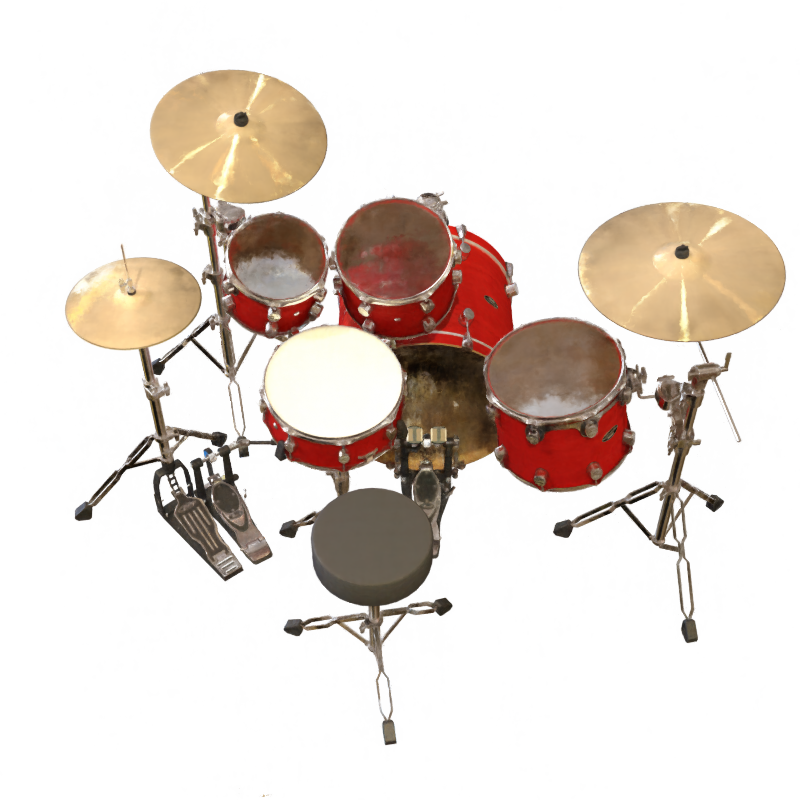
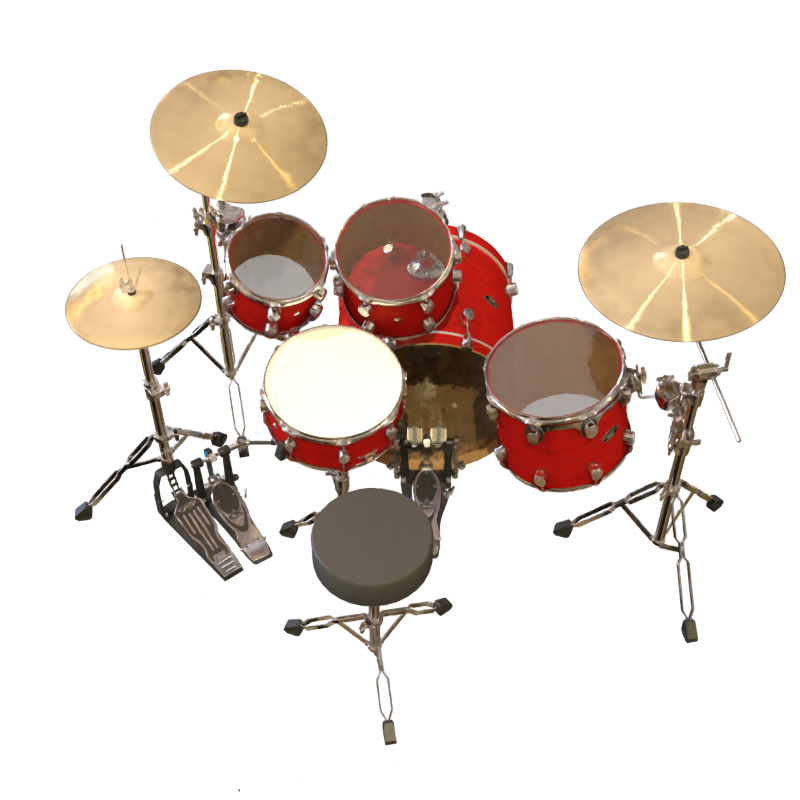

# [CVPR2023]: ABLE-NeRF: Attention-Based Rendering with Learnable Embeddings for Neural Radiance Field


The repo contains the sample code for the paper:

[CVPR2023]: ABLE-NeRF: Attention-Based Rendering with Learnable Embeddings for Neural Radiance Field


## Table of Contents

- [Installation](#installation)
- [Usage](#usage)
- [Contributing](#contributing)
- [License](#license)
- [Acknowledgements](#acknowledgements)

## Installation

1. Clone the repository:

git clone https://github.com/TangZJ/able-nerf.git

2. Navigate to the project directory:

cd able-nerf

3. Install the required dependencies:

Install conda environment with python=3.9

Install dependencies under dependencies.yaml

## Ouputs

Ref-NeRF



ABLE-NeRF




## Usage

Dataset:
Download the datasets from the NeRF official Google Drive and unzip into your folder

To run training:

```bash
# Example usage command
# Alter the data_dir file to change scene accordingly with this flag: ++dataset.data_dir='/mnt/lustre/zjtang/data/nerf_synthetic/drums'
# Tip: See full_eval.sh for range of commands/flags  to change
# Code is executed in ddp; {++train.batch_size=1024} is per gpu batch size. 
# If you have 4 GPUs, it should call 4096 batch size automatically
# By changing the batch size, you should change the {++optimizer.max_steps=xxx ++optimizer.lr_delay_steps=xxx} accordingly to match 
# dataset.factor flag divides image size. e.g using factor 2 halves the image; 0 for full image

python main.py +dataset=drums ++dataset.factor=0 

# For SLURM job clusters: #change ntasks-per-node, gres, worldsize to gpu and node size
sbatch full_data.sh

# To generate test images on 1 gpu:
# {++expt_settings.test_name} is the output folder
sh full_eval.sh 


Acknowledgements
Thanks to hjxwhy for the pytorch_lightning implementation
Check out: https://github.com/hjxwhy/mipnerf_pl


Other notes:
# you can try using pytorch 2.0 or even xformers for speedups on transformers

# able-nerf
